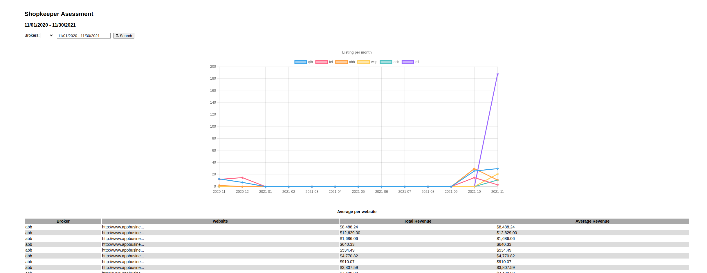

# Shopkeeper asessment



## How to run

Replace .env_sample to .env and set database values

Using Container install [docker](https://docs.docker.com/engine/install/) if not installed

- Build the container

```sh
$ docker-compose build
```

- Run container

```sh
$ docker-compose up
```

Open
```
http://localhost:3000
```

## APIS route

### Listings

```
[GET] http://localhost:3000/api/details/listings
```

Params:


| Field | value |
|-------|-------|
| broker | Int site_id|
| startDate | Date YYYY-MM-DD |
| endDate | Date YYYY-MM-DD |

Response:

```json
{
    "success": "OK",
    "data": {
        "deals": [
            {
                "listing_id": "http://www.appbusine...",
                "url": "http://www.appbusinessbrokers.com/properties/545983/",
                "listing_month": 11,
                "listing_date": "2020-11-10",
                "broker": "abb",
                "revenue": "$848,824.00",
                "parse_revenue": "$848,824.00"
            },
            {
                "listing_id": "http://www.appbusine...",
                "url": "http://www.appbusinessbrokers.com/properties/501216/",
                "listing_month": 11,
                "listing_date": "2020-11-11",
                "broker": "abb",
                "revenue": "$1,262,900.00",
                "parse_revenue": "$1,262,900.00"
            },
        ]
    }
}
```

### Listings Sum


```
[GET] http://localhost:3000/api/details/listings_sum
```

Params:


| Field | value |
|-------|-------|
| broker | Int site_id|
| startDate | Date YYYY-MM-DD |
| endDate | Date YYYY-MM-DD |

Response: 

```json
{
    "success": "OK",
    "data": [
        {
            "label": "qlb",
            "data": [
                13,
                7,
                0,
                0,
                0,
                0,
                0,
                0,
                0,
                0,
                0,
                26,
                30,
                9
            ]
        },
    ]
}
```
